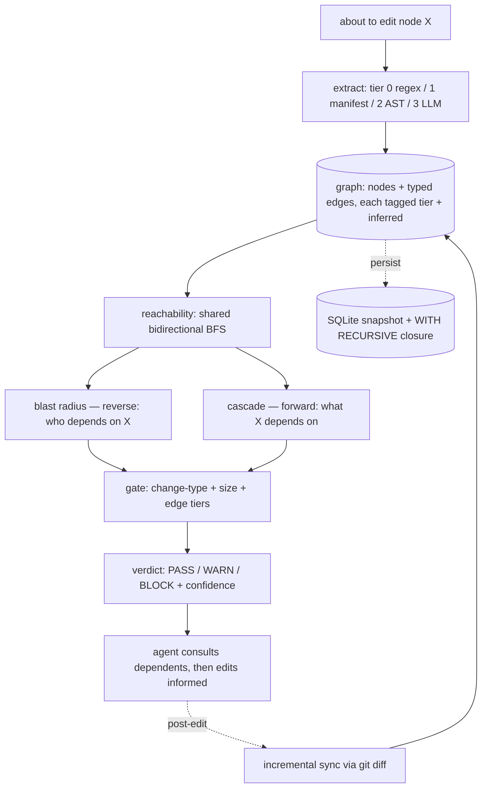

# Architecture

Trellis sits between "I'm about to edit" and "I'm editing": it conditions the edit with a proven
reachability set and a triage verdict. The graph proves reachability; it never claims breakage.

## Flow

## Modules

| module | responsibility |
|---|---|
| `lib/extract.js` | tiered extraction (regex + manifest + acorn AST); `buildGraph` with injectable deps |
| `lib/ast.js` | tier-2 acorn: calls/refs/inherits, cross-file resolution via imports |
| `lib/graph.js` | pure graph model, shared `bfs`, reachability/blast/cascade, SCC, bounded closure, JSONL |
| `lib/gate.js` | PASS/WARN/BLOCK verdict with confidence + change-type |
| `lib/refine.js` | per-node confidence + risk ranking (the precision stage) |
| `lib/llm-edges.js` | tier-3 edge merge with mandatory `evidence` validation |
| `lib/persist.js` | SQLite store + `WITH RECURSIVE` closure + integrity check |
| `lib/sync.js` | incremental sync via `git diff` (strip + re-extract) |
| `lib/security.js` | argument-array exec (no shell), path-traversal guard |
| `lib/pr.js` | PR-level impact from a git diff (what to test / what could break) |

## Edge tiers

`0` regex · `1` manifest · `2` AST (acorn) · `3` LLM-inferred · `4` MCP-resolved.

Every edge carries `tier` + `inferred` + `evidence`; the gate lowers confidence when inferred edges
are in the blast radius.

## Design constraints

- **Pure core** (`graph.js`, `gate.js`): I/O-free and unit-testable; I/O lives at the edges.
- **Zero native runtime deps** — acorn is pure JS; `node:sqlite` is built into Node.
- **Static scan only** — never executes target code; scoped to the project boundary; `.trellis/` gitignored.
- **Honesty is first-class** — reachability is a candidate set, not a proven breakage set (see `RISKS.md`).
